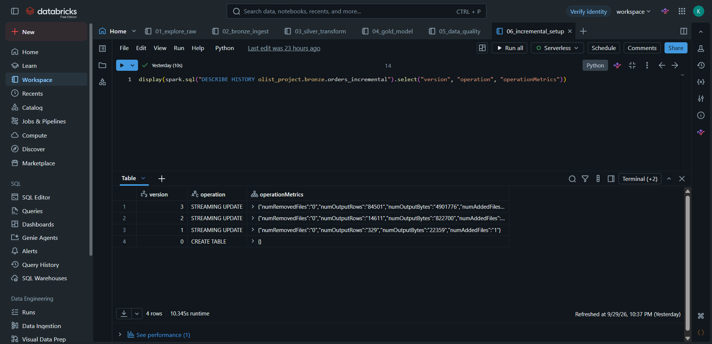
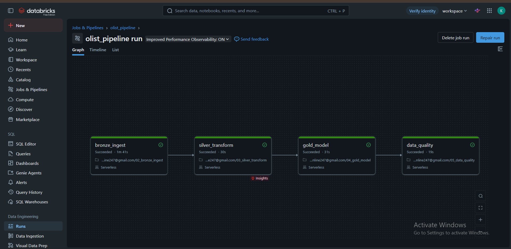
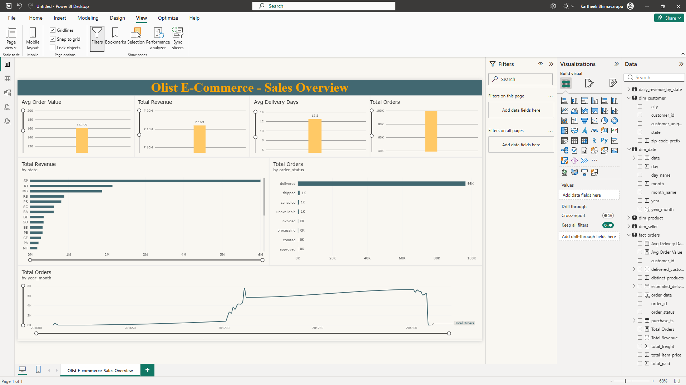
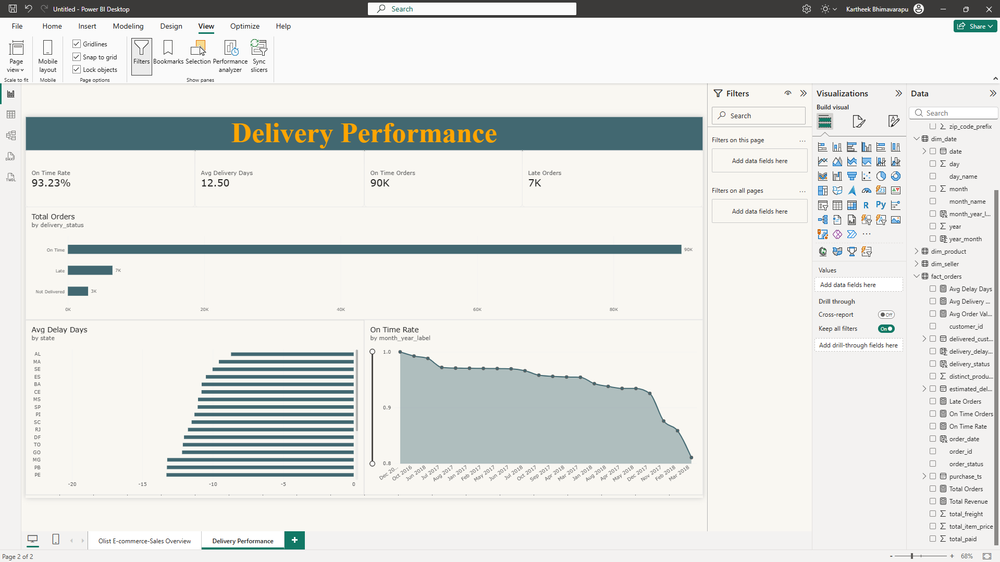
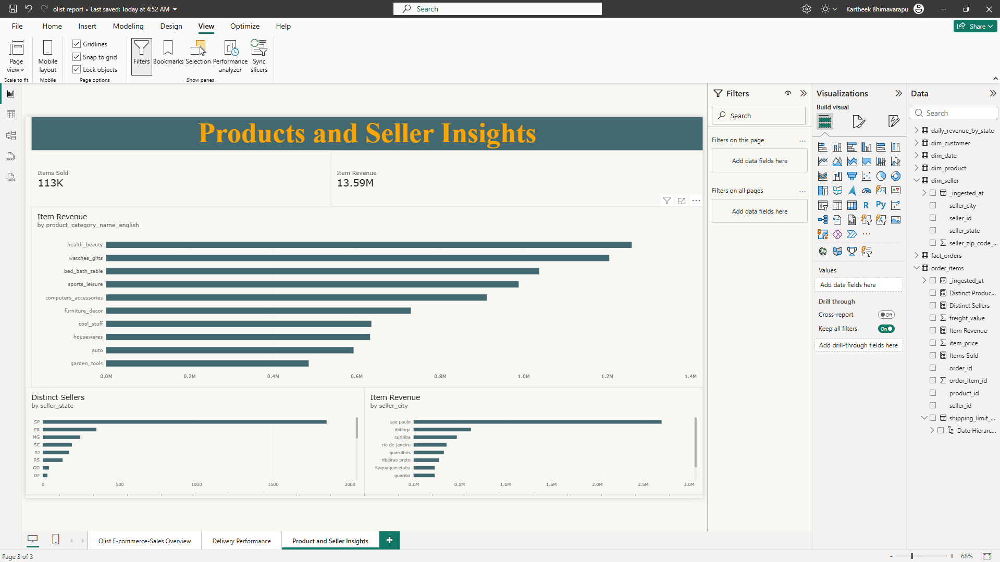

# Olist E-Commerce ELT Pipeline — Databricks + Power BI

An end-to-end ELT pipeline built on Databricks using the medallion architecture (bronze → silver → gold), with incremental loading, automated data quality checks, workflow orchestration, and a 3-page Power BI dashboard — built on the real-world Olist Brazilian E-Commerce dataset.

## Why this project

Built during a data analysis internship to get hands-on experience with the core tools and patterns used in production data engineering: Delta Lake, PySpark, Unity Catalog, Auto Loader, and Databricks Workflows — rather than just following a tutorial end to end.

## Architecture

```
9 raw CSVs (customers, orders, order_items, payments, reviews,
            products, sellers, geolocation, category_translation)
        │
        ▼
┌─────────────┐     ┌─────────────┐     ┌─────────────┐
│   BRONZE    │ ──▶ │   SILVER    │ ──▶ │    GOLD     │ ──▶ Power BI
│  Raw mirror │     │  Cleaned &  │     │  Star schema│
│  (Delta)    │     │  standardized│    │ fact + dims │
└─────────────┘     └─────────────┘     └─────────────┘
        │                                      │
        ▼                                      ▼
  Auto Loader (incremental)           Data Quality Checks
        │                                      │
        └──────────────┬───────────────────────┘
                        ▼
              Databricks Workflow
         (orchestrates all 4 stages)
```

*(Replace this text diagram with `screenshots/architecture_diagram.png` if you build one in draw.io — optional but a nice touch.)*

## Tech stack

- **Databricks** (Free Edition) — compute, notebooks, orchestration
- **PySpark** — transformations
- **Delta Lake** — storage format for all three layers (ACID, time travel)
- **Unity Catalog** — data governance, catalog/schema/table organization
- **Auto Loader** (`cloudFiles`) — incremental file ingestion with checkpointing
- **Databricks Workflows** — pipeline orchestration and scheduling
- **Power BI Desktop** — dashboarding and DAX measures

## Dataset

[Olist Brazilian E-Commerce Public Dataset](https://www.kaggle.com/datasets/olistbr/brazilian-ecommerce) (Kaggle) — ~100K orders placed on the Olist marketplace between 2016-2018, across 9 relational tables (orders, items, payments, reviews, products, sellers, customers, geolocation).

## Pipeline walkthrough

**Bronze** — all 9 CSVs loaded as-is into Delta tables, with an `_ingested_at` audit column. No cleaning; bronze is a 1:1 mirror of the source so the pipeline can always be reprocessed from scratch if downstream logic changes.

**Silver** — deduplicated on primary keys, rows with null primary/foreign keys removed, timestamp strings converted to proper timestamp types, columns renamed for clarity. Null handling here was a deliberate decision, not a blanket `fillna()` — see **Data Quality & Null Handling** below.

**Gold** — a star schema: `fact_orders` (one row per order, aggregating item prices and payments) joined to `dim_customer`, `dim_product` (enriched with English category names), `dim_seller`, and a generated `dim_date` calendar table. A pre-aggregated `daily_revenue_by_state` table supports fast dashboard queries.

## Incremental loading

Rather than a full reload every run, the `orders` table is ingested with **Auto Loader** (`cloudFiles`) and a checkpoint, simulating 3 separate daily batches arriving over time. Verified via Delta Lake's own transaction log (`DESCRIBE HISTORY`):

| Version | Operation | Rows added |
|---|---|---|
| 0 | CREATE TABLE | – |
| 1 | STREAMING UPDATE | 329 |
| 2 | STREAMING UPDATE | 14,611 |
| 3 | STREAMING UPDATE | 84,501 |

Total: 99,441 rows — matching the full source table exactly, with `numRemovedFiles: 0` on every run, confirming no reprocessing or duplication.



## Orchestration

All 4 pipeline stages (bronze → silver → gold → data quality) are chained as a single **Databricks Workflow** with explicit dependencies, so each stage only runs after the previous one succeeds.



## Data quality & null handling

A dedicated notebook checks row-count reconciliation between layers, nulls in key columns, duplicate keys, and referential integrity (fact-to-dimension orphan check via `left_anti` join) — all passed cleanly.

Nulls were handled deliberately, not uniformly:
- **Primary/foreign key nulls** (e.g. `order_id`) → rows dropped, since an unidentifiable record is unusable for joins.
- **Delivery/approval date nulls** (e.g. `order_delivered_customer_date`) → preserved as null, since they represent a real business state (order not yet delivered or cancelled), not missing data. Filling or dropping these would have fabricated or hidden legitimate information.

## Dashboard

Three Power BI report pages, connected live to the gold layer via the Databricks SQL connector.

**1. Sales Overview** — revenue, order count, AOV, and delivery-time KPIs; revenue by state; order status breakdown; monthly revenue trend.


**2. Delivery Performance** — 93.2% of orders delivered on time, with most states averaging 8-10 days *ahead* of the estimated delivery date. On-time rate declined gradually as order volume grew over the dataset's time range.


**3. Product & Seller Insights** — top product categories and sellers by revenue, seller distribution by state. Health & Beauty and Watches & Gifts are the top-revenue categories; São Paulo dominates both the seller base and seller-driven revenue, consistent with the customer-side concentration seen on page 1.


## Repository structure

```
notebooks/        — Databricks notebooks (exported as .py source files)
dashboard/         — Power BI .pbix file
screenshots/        — dashboard and pipeline evidence screenshots
```

## How to reproduce

1. Import the notebooks from `notebooks/` into a Databricks workspace (Free Edition or any workspace with Unity Catalog enabled).
2. Upload the 9 Olist CSVs to a Unity Catalog volume.
3. Run notebooks in order: `01_explore_raw` → `02_bronze_ingest` → `03_silver_transform` → `04_gold_model` → `05_data_quality` → `06_incremental_setup`, or set them up as a Databricks Workflow for one-click orchestration.
4. Open `dashboard/olist_report.pbix` in Power BI Desktop and connect it to your own Databricks SQL Warehouse (Server hostname + HTTP path from the warehouse's Connection Details tab).

## What I'd do next

- Extend incremental loading (MERGE-based upserts) to the other 8 tables, not just `orders`.
- Add automated alerting on data quality check failures.
- Load `order_items` as a second fact table at the item grain for more granular product-level analysis.

---
Built by Kartheek Bhimavarapu
